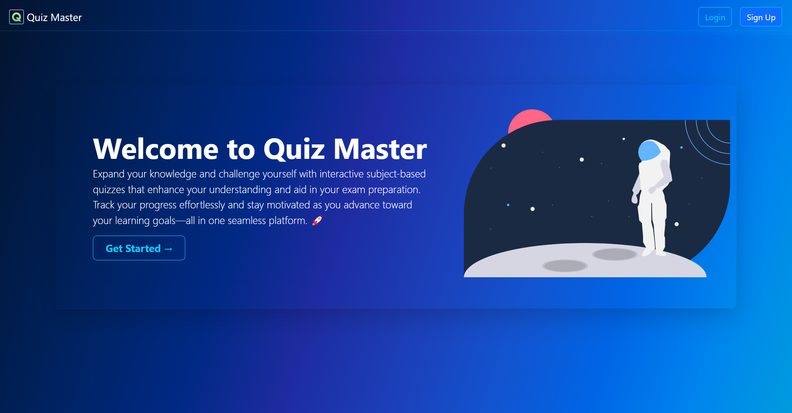
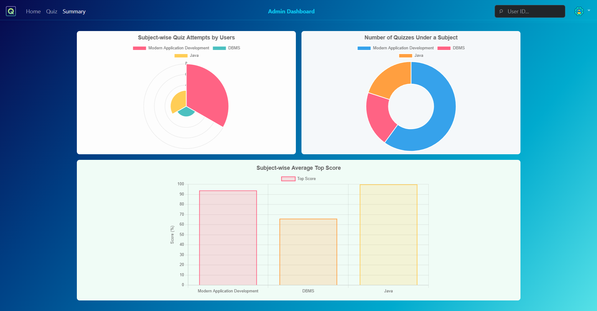
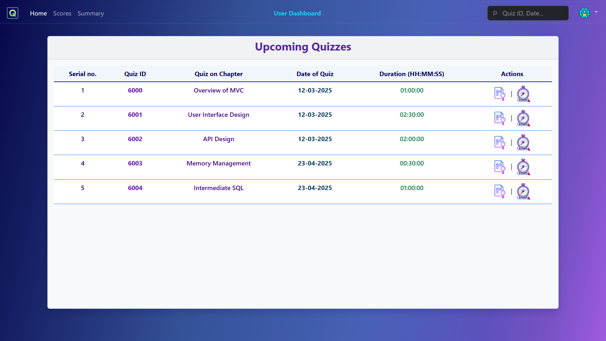

# quiz-master-v1

**quiz-master-v1** is a multi-user exam preparation web application built using Flask. It features role-based authentication for administrators and users, allowing structured quiz and subject management along with interactive performance analytics.

<p>
  
  
  
  
<p>


## 🚀 Features

### 👤 Authentication & Roles
- Role-based login system (Admin & User)
- Secure session management using Flask-Security
- Email validation and password hashing

### 🧑‍💼 Admin Dashboard
- Add/Edit/Delete Subjects and Chapters
- Create/Edit/Delete Quizzes and MCQs (one correct answer only)
- Schedule quizzes with specific date and duration
- View summary charts of quiz performance
- Search users, subjects, and quizzes

### 🎓 User Dashboard
- Attempt quizzes of interest
- Timer-enabled quiz interface
- View history of quiz attempts
- Performance summary charts for insights


## ⚙️ Installation

> Ensure Python (3.7+) and `pip` are installed on your system.

1. **Clone the repository:**

```bash
git clone https://github.com/Developer-PritamSaha/quiz-master-v1.git
cd quiz-master-v1
```

2. **Create a virtual environment (recommended):**

```bash
python -m venv venv
source venv/bin/activate  # On Windows: venv\Scripts\activate
```

3. **Install dependencies:**

```bash
pip install -r requirements.txt
```

4. **Run the app:**

```bash
python app.py
```

> 📝 *The app runs on `http://localhost:5000` by default.*  


## 🔒 Admin Credentials Initialization

Upon the first run of the app, an **admin user** is automatically created with **unique credentials** each time a new database is initialized. These credentials are stored within the **./quiz-master-v1/database** directory. However, if the **admin_credentials.txt** file is **deleted**, the admin credentials will be lost(unless you remebered them or have a backup), and you'll need to delete the entire **QuizMasterDB.sqlite3** database and restart the app to initialize a new one to generate a new admin.

**Important Notes:**
- The admin credentials **are not resettable** via the app at this time.
- If the database file is deleted, **you must delete the entire database** and restart the app to create a new admin user with fresh credentials.
- The credentials are stored directly in the database, and **if lost, they cannot be recovered**.

## 🛠 Tech Stack

- **Flask** – Backend application framework  
- **Flask-SQLAlchemy** – ORM for database interaction  
- **Flask-Security** – Role-based authentication and session management  
- **Jinja2** – Templating engine  
- **Bootstrap** – UI components and responsive design  
- **Chart.js** – For interactive charts and data visualization  
- **bcrypt** – Password hashing  
- **email_validator** – Validates email addresses on the backend  


## 📁 Additional Resources

The following helpful resources are included in the project repository:

- **Entity-Relationship (ER) Diagram**  
  Located in: `docs/ER-diagram_Quiz_master.drawio`  
  

- **API Documentation**  
  Located in: `docs/quiz_master_api_documentation.md`  
  

These resources will help you better understand the system architecture and how to interact with the backend programmatically.

---

## 🔌 API Reference

The project includes two public API endpoints for fetching quiz metadata and questions. These are useful for frontend rendering, analytics, or integration with external systems.

### 📍 `GET /api/available/quizzes`

Fetches all available quizzes up to the current date.

#### ✅ Example Response:
```json
[
  {
    "quiz_id": 6000,
    "subject_name": "Modern Application Development",
    "chapter_name": "API design",
    "no_of_questions": 10,
    "total_marks": 50,
    "date_of_quiz": "2025-03-08",
    "duration_in_sec": 3600
  }
]
```

---

### 📍 `GET /api/quiz/<quiz_id>/questions`

Retrieves all the questions for a specific quiz (up to the current date).

#### ✅ Example Response:
```json
[
  {
    "question_id": 7000,
    "type": "M.C.Q",
    "marks": 5,
    "title": "REST",
    "statement": "What does REST stand for?",
    "options": [
      "REpresentational Standard Transfer",
      "REal State Transfer",
      "REference State Transfer",
      "REpresentational State Transfer"
    ],
    "correct_option": 4
  }
]
```

### 🔓 Access

- These endpoints are **publicly accessible**.
- No authentication is required.
- Responses are returned in JSON format.


## 📌 Project Status

**Stable**, actively maintained and new features are being added.


## 🤝 Contributing

Contributions, issues, and feature requests are welcome!  
Feel free to check the [issues page](https://github.com/Developer-PritamSaha/quiz-master-v1/issues) or submit a pull request.


## 🙏 Acknowledgments

- Flask and its wonderful ecosystem
- Chart.js for seamless visualizations
- Bootstrap for responsive design


## 🙌 Closing Note

**Quiz Master v1** is a personal project built with the intent to enhance learning and provide a clean, functional quiz-taking experience. While the app is still evolving, it is stable and ready for real use in academic or self-learning environments.

I'm actively working on new features and improvements for **v2**, and I welcome feedback, suggestions, and contributions from the community. 🚀

Feel free to explore, learn, and contribute — and if this project helps you in any way, a star ⭐ on the repository would be appreciated!

---

Created by [Pritam Saha](https://github.com/Developer-PritamSaha) - Let's make application developent amazing together! 🔥
